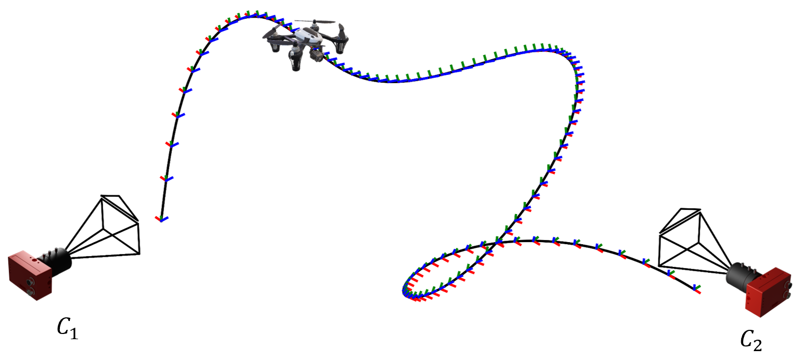
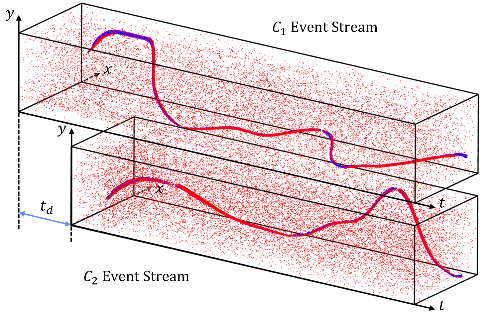

# EventSync: Joint Recovery of Temporal Offsets and Relative Orientations for Wide-Baseline Event Cameras

## Abstract

Event-based cameras offer significant advantages due to their high temporal resolution and low power consumption. However, when deploying multiple such cameras, a critical challenge emerges: each camera operates on an independent time system, resulting in temporal misalignment that severely degrades performance in multi-event camera applications. Traditional hardware-based synchronization methods face significant limitations in compatibility and are impractical for wide-baseline configurations.

We introduce EventSync, a software-based algorithm that achieves millisecond-level synchronization by exploiting the motion of objects in the cameras' shared field of view, while simultaneously estimating the relative orientation between cameras. Our approach eliminates the need for physical connections, making it particularly valuable for wide-baseline deployments.

&nbsp;

<div align="center">
    <div align="center">
        
    </div>
    <div style="color: gray; font-size: 10px;">
        Dual-perspective event capture with two cameras recording a moving object from divergent viewpoints
    </div>
</div>
&nbsp;

<div align="center">
    <div align="center">
        
    </div>
    <div style="color: gray; font-size: 10px;">
        Temporal offset between asynchronous event streams
    </div>
</div>
&nbsp;

## Key Features

- **Hardware-Free Synchronization**: Achieve millisecond-level synchronization without specialized hardware or physical connections
- **Joint Estimation**: Simultaneously recover both temporal offsets and relative camera orientations (fundamental matrix)
- **Wide-Baseline Support**: Designed specifically for challenging scenarios where cameras are separated by large distances
- **Single Moving Object**: Requires only a single distinguishable moving object (like a drone or bird) within the shared field of view
- **Sub-millisecond Accuracy**: Consistently achieves high precision across varying camera configurations

## Usage

To get started, follow the step-by-step instructions below:

1. **Dataset Download**: 
   - Begin by downloading our datasets from our provided [OneDrive link](https://connecthkuhk-my.sharepoint.com/:u:/g/personal/wlxing_connect_hku_hk/EVSg1mM93ptEm1NTZR-gA1oB-Jbv2ZxRBSfHPWfVeZjHTQ?e=nHeeFk). 
   - Additionally, if you wish to simulate more data yourself, you can leverage the configurations we provide and use the ESIM tool, available at [ESIM's GitHub Repository](https://github.com/uzh-rpg/rpg_esim).

2. **Environment Setup**:
   - Navigate to the `./config` directory where you can find the `ssac.yaml` file.
   - Use this yaml file to create a conda environment by running:
     ```
     conda env create -f ssac.yaml
     ```
   - Activate the newly created environment:
     ```
     conda activate ssac
     ```

3. **MATLAB Engine API Setup**:
    - Locate your MATLAB root directory. Once located, navigate to the external engines python directory by running:
        ```
        cd "matlabroot/extern/engines/python"
        ```
    - Inside this directory, set up the MATLAB Engine API by executing:
        ```
        python setup.py install
        ```

4. **Running the Code**:
   - Navigate to the `./src` directory.
   - To execute the main script, run:
     ```
     python esim_ssac.py
     ```
   - The configuration settings within the script can be easily modified to suit your needs or to experiment with different parameters.


## Results
The robustness of our proposed synchronization approach is empirically substantiated through extensive evaluations, including both simulation-based benchmarks and real-world experimental validations.
&nbsp;

<div align="center">
    <div align="center">
        
    </div>
    <div style="color: gray; font-size: 10px;">
        Unsynchronized event streams and F matrix
    </div>
</div>
&nbsp;

<div align="center">
    <div align="center">
        
    </div>
    <div style="color: gray; font-size: 10px;">
        Synchronized event streams and F matrix
    </div>
</div>

## Contributions
- Novel software-based approach for temporal synchronization of event-based cameras in wide-baseline settings.
- Simultaneous estimation of extrinsic parameters, thus integrating these processes for increased efficiency.
- Comprehensive validation of the method through simulations and real-world experiments.

## Contact

For further inquiries or questions, please contact us at [wlxing@connect.hku.hk].

Thank you for your interest in our research.

